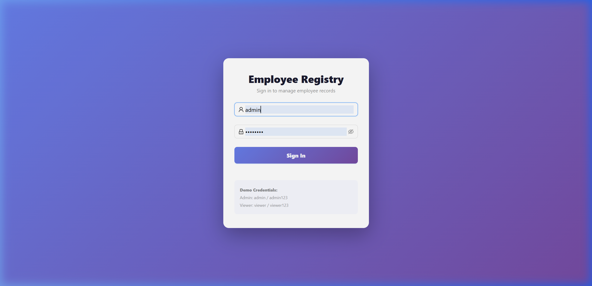
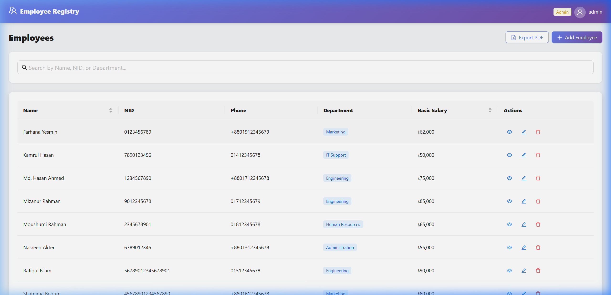
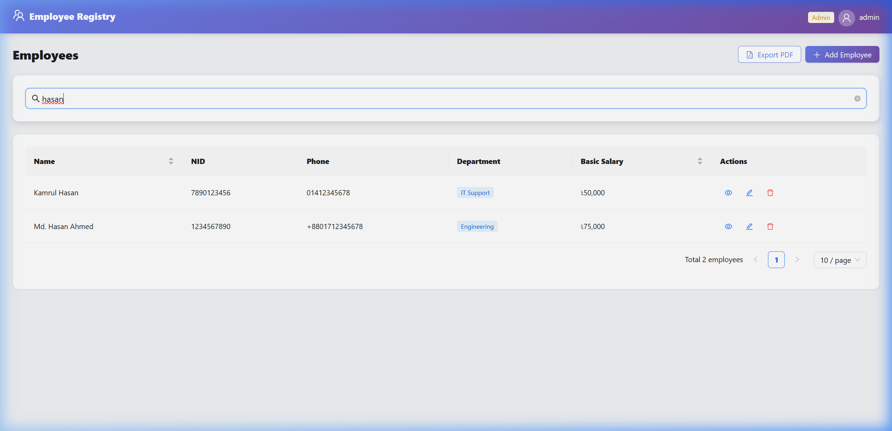
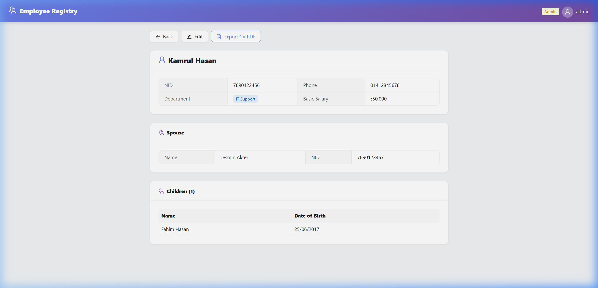

# Employee & Family Registry

A full-stack Employee Management System built with **.NET 10** (Web API) and **React** (Vite + Redux Toolkit + Ant Design), using **PostgreSQL** as the database.

## Quick Start

### 1. Clone the Repository

```bash
git clone https://github.com/Abir191197/Fionetix_DotNet_Assessment.git
cd Fionetix_DotNet_Assessment
```

### Option A: Docker (One Command — Recommended)

Just have [Docker Desktop](https://www.docker.com/products/docker-desktop/) installed, then:

```bash
docker-compose up --build
```

That's it! Open **http://localhost:3000** in your browser. Everything is running:

- Frontend → `http://localhost:3000`
- Backend API → `http://localhost:5000`
- PostgreSQL → auto-configured

---

### Option B: Manual Setup

**Prerequisites:** .NET 10 SDK, Node.js 22+, PostgreSQL 17

### 2. Setup PostgreSQL

Create the database:

```bash
psql -U postgres -c "CREATE DATABASE \"EmployeeRegistry\";"
```

> **Note:** Default connection string uses `Host=localhost;Port=5432;Username=postgres;Password=postgres`. If your PostgreSQL password is different, update `backend/EmployeeRegistry.API/appsettings.json`.

### 3. Backend Setup

```bash
cd backend/EmployeeRegistry.API

# Restore packages
dotnet restore

# Install EF Core CLI tools (if not installed)
dotnet tool install --global dotnet-ef

# Run migrations
dotnet ef migrations add InitialCreate   # (already done, skip if migrations exist)
dotnet ef database update

# Start the backend (runs on http://localhost:5000)
dotnet run --urls "http://localhost:5000"
```

### 4. Frontend Setup

Open a new terminal:

```bash
cd frontend

# Install dependencies
npm install

# Start the dev server (runs on http://localhost:5173)
npm run dev
```

### 5. Access the Application

Open **http://localhost:5173** in your browser.

**Default Credentials:**

| Username | Password    | Role               |
| -------- | ----------- | ------------------ |
| `admin`  | `admin123`  | Admin (full CRUD)  |
| `viewer` | `viewer123` | Viewer (read-only) |

## Features

- ✅ Employee CRUD (Name, NID, Phone, Department, Salary)
- ✅ Family Data (Spouse + Children per employee)
- ✅ Global Search (by Name, NID, Department — case-insensitive, debounced 400ms)
- ✅ PDF Export: Filtered employee list table
- ✅ PDF Export: Individual employee CV with family details
- ✅ Role-based Auth (Admin / Viewer) via JWT
- ✅ FluentValidation (NID: 10/17 digits, Phone: BD format)
- ✅ Unique NID enforcement at database level
- ✅ Seed data: 10 Bangladeshi employees on first run
- ✅ Docker Compose (one command to run everything)

## Screenshots

### Login Page



### Employee List



### Search (Debounced 400ms)



### Employee Detail (with Spouse & Children)



## Project Structure

```
Fionetix_DotNet_Assessment/
├── backend/
│   ├── EmployeeRegistry.sln
│   └── EmployeeRegistry.API/
│       ├── Controllers/          # API endpoints
│       ├── Data/                 # DbContext + SeedData
│       ├── DTOs/                 # Request/Response DTOs
│       ├── Extensions/           # Entity ↔ DTO mappings
│       ├── Models/               # EF Core entities
│       ├── Validators/           # FluentValidation rules
│       ├── Program.cs            # App configuration
│       └── appsettings.json      # Connection string & JWT config
├── frontend/
│   └── src/
│       ├── api/                  # Axios client with JWT interceptor
│       ├── store/                # Redux Toolkit store & slices
│       └── pages/                # React pages (Login, List, Detail, Form)
├── SRS_Document.md               # System Requirements Specification
└── README.md                     # This file
```

## API Endpoints

| Method | Endpoint                         | Auth  | Description               |
| ------ | -------------------------------- | ----- | ------------------------- |
| POST   | `/api/auth/login`                | None  | Login → JWT token         |
| GET    | `/api/employees?search=`         | All   | List with search          |
| GET    | `/api/employees/{id}`            | All   | Employee + family details |
| POST   | `/api/employees`                 | Admin | Create employee           |
| PUT    | `/api/employees/{id}`            | Admin | Update employee           |
| DELETE | `/api/employees/{id}`            | Admin | Delete employee           |
| GET    | `/api/reports/employees?search=` | All   | Data for PDF table        |
| GET    | `/api/reports/employees/{id}`    | All   | Data for CV PDF           |
